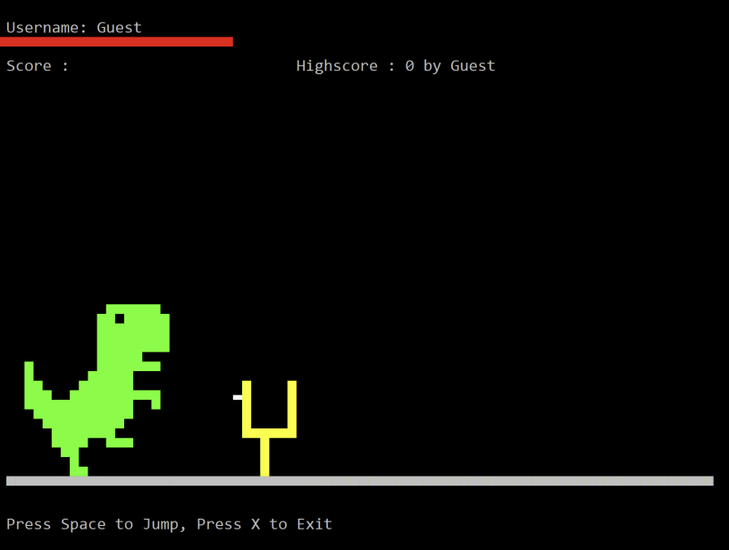

# DinoRun

A Dinosaur Run Game based on C Programming Language

*********************************************************




#### Developed: August 2021

### Developers:

- Sanjiv Pahari
- Krishna Gupta
- Manoj Bhatta
- Nabin Chaudhary

We developed this project during my 1st sem during Bachelor of Mechanical Engineering at Pulchowk Campus, Institute of Engineering, Tribhuwan University.


*********************************************************

## ABSTRACT

A computer can be used in a variety of ways. People use computers in accordance
with their needs. People's lifestyles have also changed dramatically as a result of
technological advancements. Games have become popular on computer as well. Kids,
teenager, everyone loves playing game on computer.

A programming language can be used to create a variety of useful apps and
software on a computer. C, C++, C#, Java, Python, QBASIC, and others are examples of
programming languages. We are particularly interested in the C programming language
out of all of these computer languages. Dennis M. Ritchie created the C programming
language, which is widely used to create a variety of system and application software.
This programming language has a wide range of applications including game
development.

We have developed a simple game in c-programming language. The game is titled
‘Dino Run’. In this game, the player guides a pixelated dinosaur across a side-scrolling
landscape, avoiding obstacles to achieve a higher score. The player presses the spacebar
to jump the given obstacle. If the player hits the obstacle, the game ends there.


*********************************************************

## CODING OF THE PROJECT

Here the program for the game was written in C programming language and various
functions are used to accomplish the final result. The following are the functions used in
the program.

```c
Int main()
```
>It is the main function of program. The execution of the program starts from here.

```c
Void menu()
```
>This function is used to display the initial menu to choose for user.


```c
Void Dino_Game_Home()
```
>This function is the home screen displayed after user chooses to play a new game.
Every part of the game is displayed within this function.

```c
Void Dino_Game_Main_Display()
```
>This function displays the data including the current score and the highest score of
user.

```c
Void top10_score()
```
>This function displays the highest 10 scores scored by users.

```c
Void your_rank()
```
>This function displays the highest scores scored by a specific user.

```c
Void reset_history()
```
>This function is used to reset all the data that is stored including the highest score
and user data.

```c
Void updatae_highscore()
```
>This function is used to update the highest score in real time.

```c
Void print_obstacle()
```
>This function prints the obstacles for dino to jump .

```c
Void print_dino_upperbody()
```
>This function prints, as the name suggests, the body of the dino in game.

